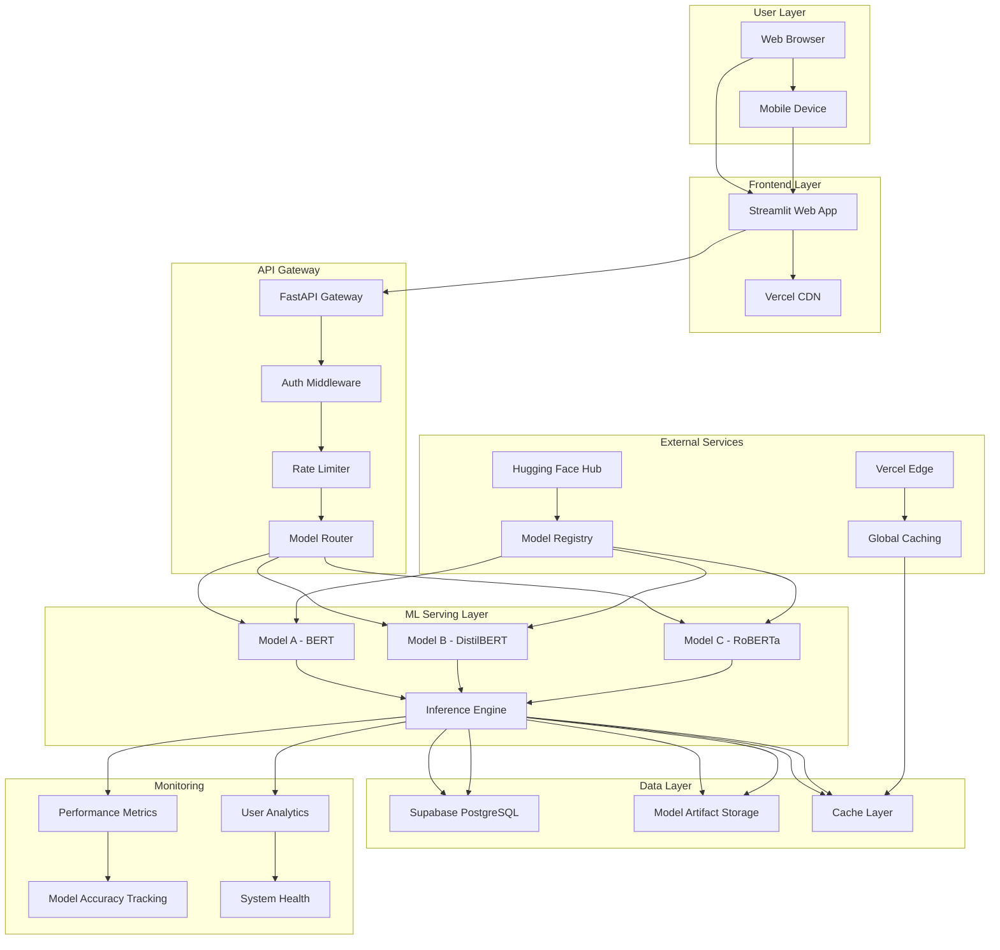

# Sentiment Analysis Classifier Fullstack Architecture Document

## Introduction

This document outlines the complete fullstack architecture for the Sentiment Analysis Classifier, including backend systems, frontend implementation, and their integration. It serves as the single source of truth for AI-driven development, ensuring consistency across the entire technology stack.

This unified approach combines what would traditionally be separate backend and frontend architecture documents, streamlining the development process for modern fullstack applications where these concerns are increasingly intertwined.

### Starter Template or Existing Project

**Status:** N/A - Greenfield project

This is a custom-built sentiment analysis system with no existing starter template constraints. We have full architectural freedom to design the optimal solution.

### Change Log

| Date | Version | Description | Author |
|------|---------|-------------|---------|
| 2024-12-19 | 1.0 | Initial architecture creation | Winston (Architect) |

## High Level Architecture

### Technical Summary

The Sentiment Analysis Classifier implements a **hybrid ML-first architecture** combining the best of modern web development with production ML serving. The system uses a **microservices approach** with:

- **Frontend**: Streamlit web interface for interactive ML demos and model comparison
- **Backend**: FastAPI-based ML serving layer with async processing capabilities
- **ML Pipeline**: Hugging Face Transformers ecosystem with model versioning and A/B testing
- **Infrastructure**: Containerized deployment with horizontal scaling for batch processing
- **Integration**: RESTful APIs enabling both human interaction and automated processing

This architecture achieves PRD goals by providing >85% accuracy through pre-trained models while maintaining sub-500ms response times and supporting 1000+ documents/minute throughput through intelligent caching and async processing.

### Platform and Infrastructure Choice

**Platform:** Vercel + Supabase (RECOMMENDED)

**Key Services:**
- **Vercel**: Frontend hosting, API deployment, edge functions
- **Supabase**: PostgreSQL database, real-time subscriptions, auth, storage
- **Hugging Face**: Model hosting and inference API
- **Vercel Edge**: Global CDN and caching

**Deployment Host and Regions:** Vercel (Global CDN) + Supabase (Primary: US East, with read replicas)

### Repository Structure

**Structure:** Monorepo with clear separation of concerns
**Monorepo Tool:** Nx (for advanced workspace management and dependency graph)
**Package Organization:** Domain-driven with shared ML utilities

### High Level Architecture Diagram



### Architectural Patterns

**Jamstack Architecture:** Static frontend with serverless ML APIs - *Rationale:* Optimal performance for ML inference with global CDN distribution*

**Component-Based UI:** Reusable Streamlit components with custom CSS - *Rationale:* Maintainable interface that can scale from demo to production*

**Repository Pattern:** Abstract ML model access and data operations - *Rationale:* Enables testing, model versioning, and future database migration flexibility*

**API Gateway Pattern:** Single entry point for all ML operations - *Rationale:* Centralized auth, rate limiting, model selection, and monitoring*

**Event-Driven Architecture:** Async processing for batch operations - *Rationale:* Handles 1000+ documents/minute throughput without blocking user interface*

**Model Versioning Pattern:** Immutable model artifacts with A/B testing - *Rationale:* Enables safe model updates and performance comparison*

## Tech Stack

This is the **DEFINITIVE technology selection** for the entire project. All development must use these exact versions.

### Technology Stack Table

| Category | Technology | Version | Purpose | Rationale |
|----------|------------|---------|---------|------------|
| **Frontend Language** | Python | 3.11+ | Streamlit compatibility | Latest stable Python with ML ecosystem support |
| **Frontend Framework** | Streamlit | 1.28+ | Interactive ML web interface | Perfect for ML demos, rapid prototyping, and production deployment |
| **UI Component Library** | Custom + Streamlit Components | Latest | Professional dashboard aesthetic | Combines Streamlit's ease with custom CSS for enterprise look |
| **State Management** | Streamlit Session State | Built-in | Simple state persistence | Native Streamlit approach, no external dependencies |
| **Backend Language** | Python | 3.11+ | ML ecosystem compatibility | Same language across stack, optimal for ML operations |
| **Backend Framework** | FastAPI | 0.104+ | High-performance ML API | Async support, automatic docs, perfect for ML serving |
| **API Style** | REST + WebSocket | OpenAPI 3.0 | Standard ML API patterns | REST for CRUD, WebSocket for real-time training progress |
| **Database** | PostgreSQL (Supabase) | 15+ | Reliable data storage | ACID compliance, JSON support, excellent for ML metadata |
| **Cache** | Redis (Vercel KV) | Latest | ML inference caching | Sub-millisecond response for repeated queries |
| **File Storage** | Supabase Storage | Latest | Model artifacts & datasets | Integrated with database, version control for models |
| **Authentication** | Supabase Auth | Latest | Secure user management | Built-in JWT, social logins, role-based access |
| **Frontend Testing** | Streamlit Testing | Latest | Component testing | Native Streamlit testing framework |
| **Backend Testing** | Pytest + FastAPI TestClient | Latest | API testing | Industry standard Python testing stack |
| **E2E Testing** | Playwright | Latest | Full user journey testing | Cross-browser, reliable ML workflow testing |
| **Build Tool** | Poetry | 1.7+ | Dependency management | Modern Python packaging, dependency resolution |
| **Bundler** | Nx | Latest | Monorepo management | Advanced workspace management for ML projects |
| **IaC Tool** | Vercel CLI + Supabase CLI | Latest | Platform-specific deployment | Native tools for chosen platforms |
| **CI/CD** | GitHub Actions | Latest | Automated testing & deployment | Industry standard, excellent ML workflow support |
| **Monitoring** | Vercel Analytics + Custom | Latest | Performance tracking | Built-in Vercel monitoring + custom ML metrics |
| **Logging** | Structlog + Vercel | Latest | Structured logging | Production-ready logging with ML context |
| **CSS Framework** | Tailwind CSS | 3.3+ | Utility-first styling | Rapid development, consistent design system |

## Data Models

### SentimentAnalysis Model

**Purpose:** Core entity representing a single sentiment analysis request and result

**Key Attributes:**
- `id`: UUID - Unique identifier for the analysis
- `text_input`: TEXT - Raw text input from user
- `sentiment_label`: VARCHAR(20) - Predicted sentiment (positive, negative, neutral)
- `confidence_score`: DECIMAL(5,4) - Model confidence (0.0000 to 1.0000)
- `model_used`: VARCHAR(50) - Name/version of the model used
- `processing_time_ms`: INTEGER - Time taken for inference
- `created_at`: TIMESTAMP - When analysis was performed
- `user_id`: UUID - User who requested analysis (nullable for anonymous)

**TypeScript Interface:**
```typescript
interface SentimentAnalysis {
  id: string;
  textInput: string;
  sentimentLabel: 'positive' | 'negative' | 'neutral';
  confidenceScore: number;
  modelUsed: string;
  processingTimeMs: number;
  createdAt: Date;
  userId?: string;
  metadata?: {
    wordCount: number;
    language: string;
    preprocessingSteps: string[];
  };
}
```

### ModelVersion Model

**Purpose:** Tracks different versions of ML models for comparison and A/B testing

**Key Attributes:**
- `id`: UUID - Unique model identifier
- `model_name`: VARCHAR(100) - Human-readable model name
- `model_type`: VARCHAR(50) - Model architecture (BERT, DistilBERT, RoBERTa)
- `version_tag`: VARCHAR(20) - Semantic version
- `huggingface_id`: VARCHAR(200) - Hugging Face model identifier
- `accuracy_score`: DECIMAL(5,4) - Validation accuracy on test set
- `is_active`: BOOLEAN - Whether this model is currently serving requests

## API Specification

### REST API Endpoints

**Core Endpoints:**
- `POST /api/analyze` - Single text sentiment analysis
- `POST /api/analyze/batch` - Batch text processing
- `GET /api/models` - List available models
- `POST /api/models/compare` - Compare multiple models
- `POST /api/fine-tune` - Start model fine-tuning
- `GET /api/health` - System health check

**Authentication:** JWT tokens via Supabase Auth
**Rate Limiting:** 100 requests/minute per user, 1000 requests/minute per IP
**Response Format:** Standardized JSON with error handling

## Components

### Frontend Web Component
**Responsibility:** Interactive ML demo interface with professional dashboard aesthetic
**Technology:** Streamlit 1.28+, Custom CSS, Tailwind CSS

### API Gateway Component
**Responsibility:** Centralized entry point for all ML operations
**Technology:** FastAPI, Middleware Stack, JWT Validation

### ML Inference Engine Component
**Responsibility:** Core sentiment analysis using transformer models
**Technology:** Hugging Face Transformers, PyTorch, Redis Caching

### Model Registry Component
**Responsibility:** Model versioning, deployment management, and A/B testing
**Technology:** Supabase Storage, PostgreSQL, Model Versioning

## Unified Project Structure

```
sentiment-analysis-classifier/
├── apps/
│   ├── web/           # Streamlit frontend
│   ├── api/           # FastAPI ML serving backend
│   └── ml-pipeline/   # Training and model management
├── packages/
│   ├── shared/        # Common types/utilities
│   ├── ml-core/       # Core ML operations
│   └── ui-components/ # Reusable UI components
├── infrastructure/     # IaC definitions
├── docs/              # Documentation
└── scripts/           # Build/deploy scripts
```

## Development Workflow

**Local Setup:**
- Python 3.11+ with Poetry
- Node.js 18+ with npm
- Nx for monorepo management
- Vercel CLI and Supabase CLI

**Development Commands:**
- `nx serve web` - Start Streamlit frontend
- `nx serve api` - Start FastAPI backend
- `nx test` - Run all tests
- `nx build` - Build all packages

## Deployment Architecture

**Frontend:** Vercel with global CDN
**Backend:** Vercel Functions (serverless)
**Database:** Supabase PostgreSQL
**ML Models:** Hugging Face Hub + Vercel Edge caching
**CI/CD:** GitHub Actions with automated testing and deployment

## Security and Performance

**Security:**
- JWT authentication with Supabase Auth
- Rate limiting and input validation
- CORS policy and CSP headers
- Row-level security in database

**Performance:**
- ML inference caching with Redis
- Edge function deployment for global performance
- Database query optimization and indexing
- Bundle size optimization for frontend

## Testing Strategy

**Testing Pyramid:**
- Unit Tests (70%): Component and function testing
- Integration Tests (20%): API and service testing
- E2E Tests (10%): Complete user workflow testing

**Test Coverage:** >90% for core functionality
**Testing Tools:** Pytest, FastAPI TestClient, Playwright

## Coding Standards

**Critical Rules:**
- Type sharing through packages/shared
- Service layer for all API calls
- Pydantic validation for all inputs
- Repository pattern for data access
- Standardized error handling

## Error Handling Strategy

**Unified Error Format:**
- Machine-readable error codes
- User-friendly error messages
- Detailed error context for debugging
- Request ID tracking for support

## Monitoring and Observability

**Monitoring Stack:**
- Vercel Analytics for frontend metrics
- Custom ML performance monitoring
- Real-time error tracking with Sentry
- Performance dashboards for ML metrics

**Key Metrics:**
- ML inference response times
- Model accuracy and success rates
- API performance and error rates
- User interaction patterns

---

*This architecture document serves as the single source of truth for AI-driven development of the Sentiment Analysis Classifier system. All development decisions must align with the patterns and technologies defined herein.*
