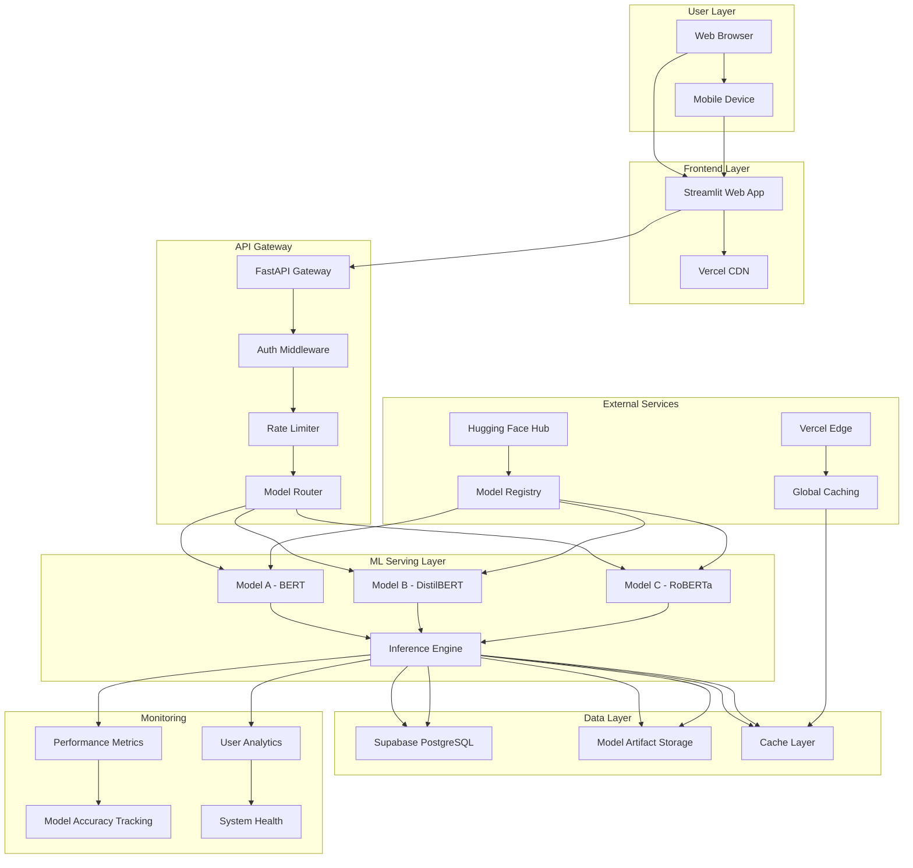

# High Level Architecture

### Technical Summary

The Sentiment Analysis Classifier implements a **hybrid ML-first architecture** combining the best of modern web development with production ML serving. The system uses a **microservices approach** with:

- **Frontend**: Streamlit web interface for interactive ML demos and model comparison
- **Backend**: FastAPI-based ML serving layer with async processing capabilities
- **ML Pipeline**: Hugging Face Transformers ecosystem with model versioning and A/B testing
- **Infrastructure**: Containerized deployment with horizontal scaling for batch processing
- **Integration**: RESTful APIs enabling both human interaction and automated processing

This architecture achieves PRD goals by providing >85% accuracy through pre-trained models while maintaining sub-500ms response times and supporting 1000+ documents/minute throughput through intelligent caching and async processing.

### Platform and Infrastructure Choice

**Platform:** Vercel + Supabase (RECOMMENDED)

**Key Services:**
- **Vercel**: Frontend hosting, API deployment, edge functions
- **Supabase**: PostgreSQL database, real-time subscriptions, auth, storage
- **Hugging Face**: Model hosting and inference API
- **Vercel Edge**: Global CDN and caching

**Deployment Host and Regions:** Vercel (Global CDN) + Supabase (Primary: US East, with read replicas)

### Repository Structure

**Structure:** Monorepo with clear separation of concerns
**Monorepo Tool:** Nx (for advanced workspace management and dependency graph)
**Package Organization:** Domain-driven with shared ML utilities

### High Level Architecture Diagram

### Architectural Patterns

**Jamstack Architecture:** Static frontend with serverless ML APIs - *Rationale:* Optimal performance for ML inference with global CDN distribution*

**Component-Based UI:** Reusable Streamlit components with custom CSS - *Rationale:* Maintainable interface that can scale from demo to production*

**Repository Pattern:** Abstract ML model access and data operations - *Rationale:* Enables testing, model versioning, and future database migration flexibility*

**API Gateway Pattern:** Single entry point for all ML operations - *Rationale:* Centralized auth, rate limiting, model selection, and monitoring*

**Event-Driven Architecture:** Async processing for batch operations - *Rationale:* Handles 1000+ documents/minute throughput without blocking user interface*

**Model Versioning Pattern:** Immutable model artifacts with A/B testing - *Rationale:* Enables safe model updates and performance comparison*

