# Sentiment Analysis Classifier UI/UX Specification

This document defines the user experience goals, information architecture, user flows, and visual design specifications for Sentiment Analysis Classifier's user interface. It serves as the foundation for visual design and frontend development, ensuring a cohesive and user-centered experience.

## Overall UX Goals & Principles

### Target User Personas

**Power User - Aspiring Data Scientists & NLP Practitioners:**
Technical professionals (CS students, bootcamp graduates, career changers) with 2-5 years programming experience who need advanced features, model comparison capabilities, and educational depth. They prioritize learning modern NLP techniques while building portfolio pieces that demonstrate production-ready skills to employers.

**Casual User - Small Business Owners & Product Managers:**
Non-technical professionals (product managers, marketing professionals, small business owners) who need simple, automated sentiment analysis without extensive technical setup. They prioritize clear results interpretation, cost-effective solutions, and business decision-making support over technical depth.

**Administrator - Technical Decision Makers:**
System managers and technical leads who need oversight capabilities, performance monitoring, and deployment control. They require comprehensive analytics, system health monitoring, and the ability to manage API access and usage patterns.

### Usability Goals

1. **Ease of learning:** New users can complete basic sentiment analysis within 2 minutes of first visit
2. **Efficiency of use:** Power users can compare multiple models and export results with minimal clicks (< 5 interactions)
3. **Error prevention:** Clear validation and confirmation for model selection, batch uploads, and API configurations
4. **Memorability:** Infrequent users can return and navigate core features without relearning interface patterns
5. **Educational value:** Technical users understand attention mechanisms and model differences through interactive visualizations
6. **Production readiness:** Interface demonstrates enterprise-quality design suitable for portfolio presentations and interviews

### Design Principles

1. **Clarity over cleverness** - Prioritize clear communication of AI predictions and confidence levels over aesthetic innovation
2. **Progressive disclosure** - Start with simple text input, reveal advanced features (model comparison, explainability) as users explore
3. **Consistent patterns** - Use familiar UI patterns throughout the application while maintaining professional SaaS aesthetic
4. **Immediate feedback** - Every analysis request shows real-time progress and provides instant visual results
5. **Accessible by default** - Design for all users from the start with WCAG AA compliance and inclusive design principles

### Change Log

| Date | Version | Description | Author |
|------|---------|-------------|---------|
| 2024-12-19 | 1.0 | Initial specification creation | Sally (UX Expert) |

## Information Architecture (IA)

### Site Map / Screen Inventory

```mermaid
graph TD
    A["🏠 Landing/Demo Page"] --> B["📊 Model Comparison Dashboard"]
    A --> C["🔧 Fine-Tuning Workshop"]
    A --> D["🔍 Explainability Explorer"]
    A --> E["📁 Batch Processing Center"]
    A --> F["📋 API Documentation Hub"]
    A --> G["📈 Performance Analytics"]
    
    B --> B1["Model Selection"]
    B --> B2["Performance Metrics"]
    B --> B3["Speed Benchmarks"]
    
    C --> C1["Dataset Upload"]
    C --> C2["Training Configuration"]
    C --> C3["Progress Monitoring"]
    C --> C4["Model Evaluation"]
    
    D --> D1["Attention Heatmaps"]
    D --> D2["Word Contributions"]
    D --> D3["LIME/SHAP Analysis"]
    
    E --> E1["File Upload"]
    E --> E2["Job Status Tracking"]
    E --> E3["Results Download"]
    
    F --> F1["API Explorer"]
    F --> F2["Authentication Setup"]
    F --> F3["Code Examples"]
    
    G --> G1["Usage Metrics"]
    G --> G2["Model Performance"]
    G --> G3["System Health"]
```

### Navigation Structure

**Primary Navigation:** Clean tab-based structure with distinct workflows:
- **Analyze** (Landing/Demo) - Immediate text input and sentiment analysis
- **Compare** (Model Dashboard) - Side-by-side model performance evaluation  
- **Train** (Fine-Tuning) - Custom model training and evaluation workflows
- **Process** (Batch Center) - Bulk file processing and results management
- **Monitor** (Analytics) - System performance and usage insights
- **Docs** (API Hub) - Developer documentation and integration guides

**Secondary Navigation:** Context-sensitive sidebars within each primary section:
- Model selection dropdown persistent across Analyze, Compare, and Explainability views
- Training pipeline steps clearly indicated in Fine-Tuning Workshop
- File management and job queue status in Batch Processing Center

**Breadcrumb Strategy:** Progressive disclosure pattern:
- Level 1: Current primary section (Analyze → Compare → Train)
- Level 2: Current dataset or model context when applicable  
- Level 3: Current detailed view or analysis mode

## User Flows

### Quick Sentiment Analysis Flow

**User Goal:** Get immediate sentiment results for a single text input

**Entry Points:** Landing page, direct URL access, navigation from any section

**Success Criteria:** Clear sentiment classification with confidence score displayed within 2 seconds

#### Flow Diagram

#### Edge Cases & Error Handling:
- **Empty text input:** Show helpful message "Please enter text to analyze"
- **Text too long (>512 tokens):** Auto-truncate with warning message and option to use batch processing
- **Network failure:** Retry mechanism with offline indicator and cached results option
- **Model loading error:** Fallback to alternative model with user notification
- **Special characters/emojis:** Preprocessing handles gracefully with character encoding validation

**Notes:** This flow prioritizes speed and simplicity for immediate gratification, with clear paths to more advanced features

### Model Comparison Workflow

**User Goal:** Compare different models on the same text to understand performance differences and choose optimal model

**Entry Points:** Compare tab, "Try other models" link from analysis results, model selection dropdown

**Success Criteria:** Side-by-side model results with clear performance indicators and recommendation

#### Flow Diagram

#### Edge Cases & Error Handling:
- **Model loading failure:** Continue with available models, show which failed
- **Inconsistent results:** Highlight disagreements with explanation of why models differ
- **Performance timeout:** Show partial results with completion estimates
- **Memory constraints:** Intelligent model loading to prevent system overload

**Notes:** Educational value through transparency about model differences and performance trade-offs

### Custom Model Training Flow

**User Goal:** Fine-tune a pre-trained model on custom dataset to improve domain-specific accuracy

**Entry Points:** Train tab, "Improve accuracy" suggestion from analysis results

**Success Criteria:** Successfully trained custom model with performance improvement metrics

#### Flow Diagram

#### Edge Cases & Error Handling:
- **Invalid file format:** Clear format requirements with example template download
- **Insufficient training data:** Minimum data requirements with suggestions for data augmentation
- **Training interruption:** Auto-save checkpoints with resume capability
- **Poor model performance:** Suggestions for hyperparameter adjustment and data quality improvement
- **Resource limitations:** Cloud training option or reduced model size recommendations

**Notes:** Balances educational value with practical model improvement, includes clear success metrics

### Batch Processing Workflow

**User Goal:** Efficiently analyze sentiment for large volumes of text data

**Entry Points:** Process tab, "Analyze multiple texts" from single analysis view

**Success Criteria:** Completed batch job with downloadable results in preferred format

#### Flow Diagram

#### Edge Cases & Error Handling:
- **File too large:** Chunking strategy with multiple job creation
- **Processing failure mid-batch:** Partial results recovery with restart from failure point
- **Queue system overload:** Priority handling and estimated wait times
- **Results storage timeout:** Extended download window with cloud storage integration
- **Format conversion errors:** Robust export with format validation and alternative options

**Notes:** Enterprise-grade batch processing that handles real-world data volumes and business requirements

## Wireframes & Mockups

### Design Files and Tools

**Primary Design Files:** Streamlit-based rapid prototyping with custom CSS enhancement
- **Development Approach:** Iterative design within Streamlit using custom CSS for professional styling
- **Design Tool Integration:** Figma mockups for key screens (optional, for stakeholder review)
- **CSS Framework:** Custom CSS with CSS Grid/Flexbox for responsive layouts
- **Component Library:** Streamlit components enhanced with custom styling for enterprise appearance

### Key Screen Layouts

#### Landing/Demo Page Layout

**Purpose:** Immediate text input and sentiment analysis with clear results display

**Key Elements:**
- Hero section with prominent text input area (min 500px width)
- Real-time character count and validation indicators
- Large, clear sentiment result display with confidence meter
- Quick action buttons for explanation, model switching, and examples
- Navigation tabs clearly visible but not overwhelming

**Interaction Notes:** Text input auto-focuses on page load, sentiment analysis triggers after 2-second pause or manual submit

**Design File Reference:** Primary development in Streamlit with custom CSS for professional styling

#### Model Comparison Dashboard Layout

**Purpose:** Side-by-side model performance evaluation with clear metrics visualization

**Key Elements:**
- Model selection interface (checkboxes/dropdowns) at top
- Unified text input area for consistent comparison
- Results grid showing each model's output side-by-side
- Performance metrics cards with color-coded indicators
- Interactive charts for accuracy, speed, and confidence comparison
- Export and recommendation actions prominently displayed

**Interaction Notes:** Models process in parallel with individual progress indicators, results appear as they complete

**Design File Reference:** Streamlit grid layout with custom CSS for professional dashboard appearance

#### Fine-Tuning Workshop Layout

**Purpose:** Step-by-step guided interface for custom model training with progress visualization

**Key Elements:**
- Wizard-style interface with clear step indicators
- File upload area with drag-and-drop and validation feedback
- Training configuration panel with sensible defaults
- Real-time training progress with loss curves and metrics
- Model comparison showing before/after performance
- Clear success/failure states with actionable next steps

**Interaction Notes:** Each step validates before proceeding, training progress updates in real-time with pause/resume capability

**Design File Reference:** Streamlit wizard components with custom progress visualization and professional styling

#### Batch Processing Center Layout

**Purpose:** Efficient file upload and processing management for large datasets

**Key Elements:**
- Large file upload area with drag-and-drop support
- File validation and preview table (first 10 rows)
- Configuration panel for text column selection and output options
- Job queue display with real-time status updates
- Progress tracking with ETA and completion percentage
- Results download section with multiple format options

**Interaction Notes:** File upload validates immediately, processing shows queue position and estimated completion time

**Design File Reference:** Streamlit file handling with custom queue management interface and professional styling

#### Explainability Explorer Layout

**Purpose:** Word-level attention visualization and prediction interpretation

**Key Elements:**
- Text display with interactive word highlighting
- Attention heatmap overlay showing word importance
- Contribution scores panel with ranked word list
- Comparison mode for different model predictions
- Technical explanation panel for educational purposes
- Export functionality for presentations and reports

**Interaction Notes:** Words are clickable to show individual contribution scores, heatmap updates in real-time with model changes

**Design File Reference:** Streamlit visualization components enhanced with custom CSS for professional appearance

## Component Library / Design System

### Design System Approach

**Hybrid Approach:** Leverage Streamlit's built-in components with custom CSS enhancement for professional appearance
- **Base Components:** Streamlit's native input, display, and navigation components
- **Custom Styling:** Professional CSS framework built on top of Streamlit components
- **Component Enhancement:** Custom CSS classes for enterprise-quality visual appearance
- **Accessibility:** WCAG AA compliance built into every component variant

### Core Components

#### Text Input Components

**Purpose:** Primary text entry for sentiment analysis with validation and feedback

**Variants:** 
- Standard text input (single line)
- Multi-line text area (for longer content)
- Auto-expanding text area (grows with content)

**States:** 
- Default, focused, error, success, disabled

**Usage Guidelines:** 
- Auto-focus on page load for immediate interaction
- Real-time character count and validation feedback
- Clear error messages with actionable suggestions
- Consistent styling across all input types

#### Results Display Components

**Purpose:** Clear presentation of sentiment analysis results with confidence metrics

**Variants:**
- Sentiment result card (positive/negative/neutral)
- Confidence meter with visual progress bar
- Detailed results table with multiple metrics
- Comparison grid for side-by-side model results

**States:**
- Loading, success, error, partial results

**Usage Guidelines:**
- Color-coded sentiment indicators (green/red/yellow)
- Large, clear typography for result display
- Interactive elements for detailed exploration
- Export functionality for all result types

#### Navigation Components

**Purpose:** Consistent navigation structure across all application sections

**Variants:**
- Primary tab navigation (Analyze, Compare, Train, Process, Monitor, Docs)
- Secondary sidebar navigation (context-sensitive)
- Breadcrumb navigation (for complex workflows)
- Mobile-responsive navigation menu

**States:**
- Active, inactive, hover, disabled

**Usage Guidelines:**
- Clear visual hierarchy with consistent spacing
- Responsive design for mobile and desktop
- Accessible navigation with keyboard support
- Context-sensitive secondary navigation

#### Data Visualization Components

**Purpose:** Interactive charts and graphs for model performance and explainability

**Variants:**
- Performance comparison charts (bar charts, line graphs)
- Attention heatmaps for word-level analysis
- Confusion matrices for model evaluation
- Progress indicators for training and processing

**States:**
- Loading, interactive, static, error

**Usage Guidelines:**
- Consistent color palette across all visualizations
- Interactive tooltips and hover states
- Export functionality for presentations
- Responsive design for different screen sizes

#### Feedback Components

**Purpose:** Clear communication of system status and user actions

**Variants:**
- Loading spinners and progress bars
- Success and error notifications
- Validation messages and warnings
- System status indicators

**States:**
- Info, success, warning, error, loading

**Usage Guidelines:**
- Consistent positioning and styling
- Auto-dismiss for non-critical messages
- Clear action buttons for user responses
- Accessible messaging with screen reader support

#### File Management Components

**Purpose:** Efficient handling of file uploads and batch processing

**Variants:**
- Drag-and-drop file upload areas
- File validation and preview tables
- Progress tracking for batch jobs
- Results download and export interfaces

**States:**
- Empty, uploading, processing, complete, error

**Usage Guidelines:** 
- Clear file format requirements and size limits
- Immediate validation feedback
- Progress indication for long-running operations
- Multiple export format options

## Branding & Style Guide

### Visual Identity

**Brand Guidelines:** Professional AI/Technology theme emphasizing trustworthiness, innovation, and educational value
- **Brand Personality:** Professional, approachable, technically sophisticated, trustworthy
- **Visual Style:** Clean, modern, enterprise-ready with subtle AI/ML visual cues
- **Target Impression:** Production-quality SaaS application suitable for portfolio and interview demonstrations

### Color Palette

| Color Type | Hex Code | Usage |
|------------|----------|-------|
| Primary | #2563EB | Main navigation, primary buttons, links |
| Secondary | #1E40AF | Secondary actions, hover states |
| Accent | #10B981 | Positive sentiment, success states, progress indicators |
| Success | #10B981 | Positive feedback, confirmations, successful operations |
| Warning | #F59E0B | Cautions, important notices, neutral sentiment |
| Error | #EF4444 | Errors, destructive actions, negative sentiment |
| Neutral | #F8FAFC to #1F2937 | Text, borders, backgrounds, UI elements |

### Typography

#### Font Families
- **Primary:** Inter (system fallback: -apple-system, BlinkMacSystemFont, "Segoe UI")
- **Secondary:** SF Pro Display (system fallback: system-ui, sans-serif)
- **Monospace:** JetBrains Mono (system fallback: "SF Mono", Monaco, "Cascadia Code")

#### Type Scale

| Element | Size | Weight | Line Height |
|---------|------|--------|-------------|
| H1 | 2.5rem (40px) | 700 | 1.2 |
| H2 | 2rem (32px) | 600 | 1.3 |
| H3 | 1.5rem (24px) | 600 | 1.4 |
| Body | 1rem (16px) | 400 | 1.6 |
| Small | 0.875rem (14px) | 400 | 1.5 |

### Iconography

**Icon Library:** Lucide React (open-source, consistent design language)
- **Style:** Outlined, clean, professional appearance
- **Sizing:** Consistent scale (16px, 20px, 24px, 32px)
- **Usage Guidelines:** 
  - Use for navigation, actions, and status indicators
  - Maintain consistent stroke width and visual weight
  - Provide alt text for accessibility
  - Use semantic colors for different states

### Spacing & Layout

**Grid System:** 8px base unit system for consistent spacing
- **Spacing Scale:** 4px, 8px, 16px, 24px, 32px, 48px, 64px
- **Container Max Widths:** 
  - Mobile: 100% - 32px margin
  - Tablet: 768px - 48px margin  
  - Desktop: 1200px - 64px margin
  - Wide: 1400px - 80px margin

## Accessibility Requirements

### Compliance Target

**Standard:** WCAG 2.1 AA compliance with Section 508 compatibility
- **Primary Target:** WCAG AA level for broad accessibility coverage
- **Secondary Target:** Section 508 compliance for potential government/enterprise use
- **Implementation:** Accessibility-first design approach integrated into all components

### Key Requirements

#### Visual Accessibility

**Color Contrast:**
- **Text Contrast:** Minimum 4.5:1 ratio for normal text, 3:1 for large text (18pt+)
- **UI Elements:** 3:1 contrast ratio for interactive elements and borders
- **Semantic Colors:** Color alone cannot be the only indicator of information (supplement with text/icons)

**Focus Indicators:**
- **Visible Focus:** Clear, high-contrast focus indicators for all interactive elements
- **Focus Order:** Logical tab order following visual layout and content hierarchy
- **Focus Management:** Focus moves appropriately for dynamic content and modal dialogs

**Text Sizing:**
- **Scalable Text:** Text can be resized up to 200% without loss of functionality
- **Line Spacing:** Minimum 1.5 line height for body text, 1.2 for headings
- **Font Choice:** High-legibility fonts with clear character distinction

#### Interaction Accessibility

**Keyboard Navigation:**
- **Full Keyboard Access:** All functionality accessible via keyboard (Tab, Enter, Space, Arrow keys)
- **Skip Links:** Skip navigation links for users to jump to main content
- **Keyboard Shortcuts:** Logical shortcuts for common actions (Ctrl+Enter for submit)

**Screen Reader Support:**
- **Semantic HTML:** Proper use of headings, lists, landmarks, and form labels
- **ARIA Labels:** Descriptive labels for complex UI components and dynamic content
- **Live Regions:** Announcements for real-time updates (training progress, batch processing)

**Touch Targets:**
- **Minimum Size:** 44x44px minimum touch target size for mobile interactions
- **Spacing:** Adequate spacing between interactive elements to prevent accidental activation
- **Touch Feedback:** Visual feedback for touch interactions (hover states, active states)

#### Content Accessibility

**Alternative Text:**
- **Images:** Descriptive alt text for all images, charts, and visualizations
- **Charts:** Data tables or text summaries for complex visualizations
- **Icons:** Meaningful labels for icon-only buttons and navigation elements

**Heading Structure:**
- **Logical Hierarchy:** Proper heading levels (H1 → H2 → H3) without skipping levels
- **Page Titles:** Descriptive, unique page titles for each section
- **Content Organization:** Clear content structure with appropriate heading usage

**Form Labels:**
- **Explicit Labels:** All form inputs have associated, visible labels
- **Error Messages:** Clear, specific error messages with suggestions for correction
- **Required Fields:** Clear indication of required fields and validation requirements

### Testing Strategy

**Automated Testing:**
- **Lighthouse Accessibility:** Regular automated accessibility audits
- **axe-core Integration:** Automated accessibility testing in development workflow
- **Color Contrast Tools:** Automated contrast ratio verification

**Manual Testing:**
- **Keyboard Navigation:** Complete keyboard-only navigation testing
- **Screen Reader Testing:** Testing with NVDA (Windows) and VoiceOver (macOS)
- **Visual Testing:** High-contrast mode and zoom testing (200%)

**Continuous Monitoring:**
- **Accessibility Linting:** ESLint rules for accessibility best practices
- **Code Review:** Accessibility checklist in pull request reviews
- **User Feedback:** Accessibility feedback collection from users with disabilities

## Responsiveness Strategy

### Breakpoints

| Breakpoint | Min Width | Max Width | Target Devices |
|------------|-----------|-----------|----------------|
| Mobile | 320px | 767px | Smartphones, small tablets |
| Tablet | 768px | 1023px | Tablets, large phones |
| Desktop | 1024px | 1399px | Laptops, small desktops |
| Wide | 1400px | - | Large monitors, high-resolution displays |

### Adaptation Patterns

**Layout Changes:**
- **Mobile:** Single-column layout with stacked elements, full-width containers
- **Tablet:** Two-column layout for sidebars, optimized spacing for touch
- **Desktop:** Multi-column layouts with sidebars, optimal information density
- **Wide:** Extended layouts with additional whitespace, enhanced data visualization

**Navigation Changes:**
- **Mobile:** Hamburger menu with slide-out navigation, bottom tab bar for primary actions
- **Tablet:** Collapsible sidebar navigation with persistent primary tabs
- **Desktop:** Horizontal tab navigation with secondary sidebar options
- **Wide:** Full navigation bar with additional quick access features

**Content Priority:**
- **Mobile:** Essential features only, progressive disclosure for advanced options
- **Tablet:** Core features with contextual secondary options
- **Desktop:** Full feature set with optimized layouts
- **Wide:** Enhanced visualizations and additional context panels

**Interaction Changes:**
- **Mobile:** Touch-optimized interactions, swipe gestures for navigation
- **Tablet:** Touch and mouse hybrid interactions, larger touch targets
- **Desktop:** Mouse-optimized interactions with hover states
- **Wide:** Enhanced keyboard shortcuts and advanced interaction patterns

## Animation & Micro-interactions

### Motion Principles

**Purposeful Motion:** Every animation serves a functional purpose - guiding attention, providing feedback, or improving understanding
- **Performance First:** Smooth 60fps animations that don't impact functionality
- **Accessibility Aware:** Respect user motion preferences and reduced motion settings
- **Contextual Timing:** Animations match user expectations and task complexity

### Key Animations

- **Page Transitions:** Subtle fade transitions between sections (Duration: 200ms, Easing: ease-out)
- **Loading States:** Smooth progress indicators and skeleton screens (Duration: 300ms, Easing: ease-in-out)
- **Form Validation:** Gentle shake for errors, smooth checkmark for success (Duration: 150ms, Easing: ease-in-out)
- **Data Updates:** Smooth transitions for real-time data changes (Duration: 250ms, Easing: ease-out)
- **Modal Dialogs:** Scale and fade entrance/exit animations (Duration: 200ms, Easing: ease-out)

## Performance Considerations

### Performance Goals

- **Page Load:** Initial page load under 2 seconds on 3G connection
- **Interaction Response:** UI interactions respond within 100ms
- **Animation FPS:** Maintain 60fps for all animations and transitions

### Design Strategies

**Progressive Enhancement:** Core functionality works without JavaScript, enhanced with interactive features
**Lazy Loading:** Load non-critical components and visualizations on demand
**Optimized Assets:** Compressed images, minified CSS, and efficient icon usage
**Caching Strategy:** Intelligent caching of models and frequently accessed data

## Next Steps

### Immediate Actions

1. **Stakeholder Review:** Present specification to project team for feedback and approval
2. **Design System Creation:** Develop CSS framework and component library based on specifications
3. **Prototype Development:** Create Streamlit-based prototype with custom styling
4. **Accessibility Testing:** Implement and test accessibility features throughout development
5. **Responsive Testing:** Validate responsive behavior across target devices and screen sizes

### Design Handoff Checklist

- [ ] All user flows documented with edge cases and error handling
- [ ] Component inventory complete with states and usage guidelines
- [ ] Accessibility requirements defined and testing strategy established
- [ ] Responsive strategy clear with breakpoints and adaptation patterns
- [ ] Brand guidelines incorporated with color palette and typography
- [ ] Performance goals established with measurable targets

## Checklist Results

*Note: UI/UX checklist will be run against this document once available to ensure completeness and quality standards are met.*

---

*Document Version: 1.0 | Created: December 19, 2024 | Status: Complete*
*Next Review: After stakeholder feedback and initial prototype development*

